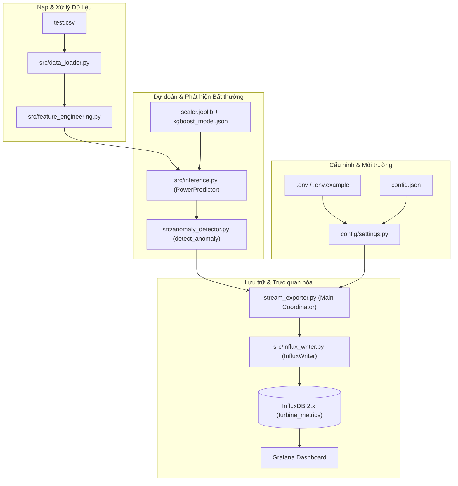

# SCADA Edge – Wind Turbine Anomaly Detection

Hệ thống giám sát biên (Edge Computing) phát hiện bất thường công suất phát của turbine gió từ dữ liệu SCADA theo thời gian thực. Quy trình xử lý bao gồm: đọc dữ liệu chuỗi thời gian SCADA từ file CSV, trích xuất các đặc trưng chu kỳ thời gian (`Day_sin`, `Day_cos`, `Month_sin`, `Month_cos`), chuẩn hóa dữ liệu bằng `StandardScaler`, dự đoán công suất phát kỳ vọng bằng mô hình `XGBoost`, tính toán sai số chênh lệch (`residual`), phát hiện bất thường dựa trên ngưỡng phương sai (`anomaly_threshold`), đồng bộ dữ liệu vào `InfluxDB` (Time-Series Database) và trực quan hóa cảnh báo trực quan trên `Grafana`.

---

## 1. Tính năng hiện tại

- **Đọc và xác thực dữ liệu SCADA**: Đọc dữ liệu từ file `test.csv`, tự động kiểm tra sự tồn tại và tính hợp lệ của các cột bắt buộc (`Date/Time`, target, features thô).
- **Trích xuất đặc trưng thời gian (Feature Engineering)**: Chuyển đổi nhãn thời gian sang dạng chu kỳ lượng giác 24 giờ (`Day_sin`, `Day_cos`) và 12 tháng (`Month_sin`, `Month_cos`).
- **Tải và tối ưu hóa tài nguyên mô hình**: Tải mô hình XGBoost (`xgboost_model.json`) và scaler (`scaler.joblib`) một lần duy nhất vào bộ nhớ khi khởi động hệ thống.
- **Dự đoán công suất thời gian thực**: Hỗ trợ dự đoán công suất chủ động (`LV ActivePower (kW)`) từ từng dòng dữ liệu định dạng `pandas.Series`, `dict` hoặc `pandas.DataFrame`.
- **Phát hiện bất thường tức thì**: Tính toán độ lệch tuyệt đối `residual = |actual_power - predicted_power|` và gán nhãn `anomaly_flag` (1 nếu vượt ngưỡng `anomaly_threshold`, 0 nếu an toàn).
- **Gửi dữ liệu thời gian thực tới InfluxDB**: Đẩy các điểm đo (Points) với độ chính xác nanosecond vào bucket `turbine_metrics`.
- **Cấu hình tham số linh hoạt**: Quản trị turbine ID, chu kỳ phát stream (`STREAM_INTERVAL_SECONDS`), URL và token kết nối qua file môi trường `.env`.
- **Cơ chế dừng an toàn (Graceful Shutdown)**: Bắt tín hiệu ngắt `KeyboardInterrupt` (`Ctrl+C`), tự động giải phóng tài nguyên và đóng kết nối HTTP client với InfluxDB.
- **Kiểm thử tự động (Unit Testing)**: Bộ kiểm thử độc lập cho module Feature Engineering và Anomaly Detection bằng `pytest`.

> [!NOTE]
> Hệ thống hiện tại vận hành mô phỏng stream tuần tự qua file dữ liệu cục bộ. Các thành phần như Apache Kafka và Apache Spark Structured Streaming là định hướng nâng cấp trong tương lai và chưa được tích hợp vào luồng chạy hiện hành.

---

## 2. Kiến trúc hệ thống

Dưới đây là sơ đồ luồng dữ liệu và sự tương tác giữa các module trong dự án:



Trong đó:
- `stream_exporter.py` đóng vai trò là **Entry Point** chính, điều phối toàn bộ quy trình: đọc cấu hình, nạp dữ liệu, gọi pipeline suy luận, phát hiện bất thường và kích hoạt writer gửi dữ liệu lên InfluxDB theo chu kỳ đã định.

---

## 3. Luồng xử lý dữ liệu (Data Pipeline)

Quy trình tuần tự của hệ thống khi thực thi:

```text
[1. Đọc biến môi trường (.env)]
        ↓
[2. Nạp file cấu hình (config.json: ngưỡng, danh sách features, target)]
        ↓
[3. Đọc dữ liệu thô (test.csv) & loại bỏ dòng NaN (data_loader.py)]
        ↓
[4. Chuyển đổi định dạng 'Date/Time' sang chuẩn datetime (%d %m %Y %H:%M)]
        ↓
[5. Tạo 4 đặc trưng chu kỳ: Day_sin, Day_cos, Month_sin, Month_cos (feature_engineering.py)]
        ↓
[6. Trích xuất đúng thứ tự 7 features theo quy định trong config.json]
        ↓
[7. Chuẩn hóa đặc trưng đầu vào qua StandardScaler (scaler.joblib)]
        ↓
[8. Dự đoán công suất kỳ vọng qua mô hình XGBoost (xgboost_model.json)]
        ↓
[9. Tính sai số tuyệt đối: residual = abs(actual_power - predicted_power)]
        ↓
[10. Xác định cờ bất thường: anomaly_flag = 1 nếu residual > anomaly_threshold else 0]
        ↓
[11. Đóng gói Point (measurement: turbine_status) và ghi đồng bộ lên InfluxDB (influx_writer.py)]
        ↓
[12. Tạm dừng STREAM_INTERVAL_SECONDS giây trước khi xử lý dòng dữ liệu kế tiếp]
```

---

## 4. Cấu trúc thư mục

```text
D:\SCDA_Edge
├── config/
│   └── settings.py          # Quản lý cấu hình tập trung từ .env và config.json
├── src/
│   ├── anomaly_detector.py  # Thuật toán tính residual và gắn cờ bất thường
│   ├── data_loader.py       # Tải CSV, xác thực schema, chuyển đổi datetime
│   ├── feature_engineering.py # Tính toán đặc trưng chu kỳ thời gian
│   ├── inference.py         # Quản lý nạp model/scaler và dự đoán công suất
│   └── influx_writer.py     # Kết nối InfluxDB client và ghi point đo lường
├── tests/
│   ├── test_anomaly_detector.py     # Unit test cho logic phát hiện bất thường
│   └── test_feature_engineering.py  # Unit test cho biến đổi thời gian chu kỳ
├── .env.example             # Mẫu biến môi trường an toàn (được theo dõi bởi Git)
├── .gitignore               # Danh sách tệp và thư mục loại trừ khỏi Git
├── config.json              # Ngưỡng phát hiện bất thường và danh sách features/target
├── docker-compose.yml       # Khởi chạy InfluxDB 2.7 và Grafana container
├── requirements.txt         # Danh sách thư viện Python cần thiết
├── scaler.joblib            # StandardScaler đã huấn luyện
├── stream_exporter.py       # File thực thi chính điều phối luồng streaming
├── test.csv                 # Tập dữ liệu SCADA kiểm thử thực tế (~5054 bản ghi)
└── xgboost_model.json       # Mô hình XGBoost Regressor đã huấn luyện
```

> [!IMPORTANT]
> - `.env`: Chứa cấu hình kết nối thực tế trên máy local (bao gồm token bảo mật) – **bị bỏ qua bởi Git, không được commit**.
> - `.env.example`: Tệp mẫu không chứa credential thật – **được commit lên Git**.
> - `.venv/`, `__pycache__/`, `.pytest_cache/`: Thư mục môi trường ảo và bộ nhớ đệm cục bộ – **không commit vào Git**.

---

## 5. Trách nhiệm của từng module

| Tệp tin / Module | Loại | Chức năng chính |
|---|---|---|
| `stream_exporter.py` | Executable | Điểm khởi chạy chính (entry point), liên kết toàn bộ pipeline, chạy vòng lặp phát dữ liệu và xử lý dừng an toàn khi nhận `Ctrl+C`. |
| `config/settings.py` | Config | Định nghĩa lớp `InfluxSettings` (đọc biến môi trường) và hàm `load_config()` (đọc `config.json`), quản lý đường dẫn `BASE_DIR`. |
| `config.json` | JSON | Lưu trữ thông số ngưỡng bất thường (`anomaly_threshold`), chỉ số đánh giá (`mae`, `rmse`), danh sách `features` và `target`. |
| `.env` | Local Env | Chứa các biến môi trường thực tế tại máy chạy (URL, Organization, Bucket, Token, Turbine ID). |
| `.env.example` | Template | Bản mẫu cấu hình an toàn hướng dẫn khai báo biến môi trường. |
| `src/data_loader.py` | Module | Hàm `load_data()` kiểm tra tính đầy đủ của cột, loại bỏ NaN và chuyển đổi `Date/Time` sang chuẩn datetime. |
| `src/feature_engineering.py` | Module | Hàm `add_time_features()` tính toán các hàm sin/cos theo chu kỳ 1440 phút trong ngày và 12 tháng trong năm. |
| `src/inference.py` | Module | Lớp `PowerPredictor` nạp scaler và model một lần, cung cấp hàm `predict()` xử lý dữ liệu đầu vào. |
| `src/anomaly_detector.py` | Module | Hàm `detect_anomaly()` tính toán độ lệch tuyệt đối giữa công suất thực tế và dự đoán, so khớp với ngưỡng để gắn cờ. |
| `src/influx_writer.py` | Module | Lớp `InfluxWriter` tạo kết nối `InfluxDBClient`, định dạng `Point` và thực hiện ghi dữ liệu đồng bộ (`SYNCHRONOUS`). |
| `test.csv` | Dataset | File CSV chứa dữ liệu cảm biến SCADA turbine gió thực nghiệm (tốc độ gió, hướng gió, công suất danh định, công suất phát). |
| `scaler.joblib` | Binary Asset | File nhị phân lưu đối tượng `StandardScaler` dùng để chuẩn hóa 7 đặc trưng đầu vào theo phân phối huấn luyện. |
| `xgboost_model.json` | Model Asset | File cấu trúc mô hình `XGBRegressor` của XGBoost đã được huấn luyện sẵn. |
| `tests/test_feature_engineering.py` | Test | Bộ unit test kiểm tra tính chính xác của các mốc thời gian đặc biệt (00:00, 06:00, 12:00, 18:00, các tháng), tính bất biến của dữ liệu đầu vào và bắt lỗi. |
| `tests/test_anomaly_detector.py` | Test | Bộ unit test kiểm tra các trường hợp chênh lệch công suất vượt ngưỡng, dưới ngưỡng, bằng ngưỡng và kiểm tra kiểu dữ liệu trả về. |
| `requirements.txt` | Dependency | Khai báo các thư viện Python: `numpy`, `pandas`, `xgboost`, `scikit-learn`, `joblib`, `influxdb-client`, `python-dotenv`, `pytest`. |
| `docker-compose.yml` | Infrastructure | Cấu hình triển khai container cho `InfluxDB 2.7` (cổng 8086) và `Grafana` (cổng 3000) cùng phân vùng lưu trữ dữ liệu bền vững (named volumes). |

---

## 6. Yêu cầu hệ thống

- **Hệ điều hành**: Windows 10/11 (khuyến nghị sử dụng PowerShell cho các lệnh hướng dẫn).
- **Python**: Phiên bản 3.10 – 3.13 (đã kiểm thử tương thích thực tế trên Python 3.13).
- **Docker**: Docker Desktop đang chạy và hỗ trợ Docker Compose (v2.x).
- **Dung lượng lưu trữ**:
  - `xgboost_model.json`: ~1.2 MB
  - `scaler.joblib`: ~1.3 KB
  - `test.csv`: ~303 KB
  - Docker images (`influxdb:2.7`, `grafana/grafana:latest`) và container volumes: khuyến nghị tối thiểu 2 GB trống.

---

## 7. Cài đặt dự án

Mở PowerShell và điều hướng tới thư mục dự án:

```powershell
cd D:\SCDA_Edge
```

### Bước 1: Khởi tạo môi trường ảo Python

```powershell
python -m venv .venv
```

### Bước 2: Cài đặt các thư viện phụ thuộc

Cài đặt trực tiếp qua trình thông dịch của môi trường ảo (không bắt buộc phải activate):

```powershell
.\.venv\Scripts\python.exe -m pip install --upgrade pip
.\.venv\Scripts\python.exe -m pip install -r requirements.txt
```

*(Tùy chọn) Nếu muốn kích hoạt môi trường ảo trong phiên làm việc PowerShell:*

```powershell
.\.venv\Scripts\Activate.ps1
```

---

## 8. Cấu hình biến môi trường (`.env`)

Tạo file `.env` từ file mẫu `.env.example`:

```powershell
Copy-Item .env.example .env
```

Nội dung chuẩn trong file `.env`:

```dotenv
INFLUX_URL=http://localhost:8086
INFLUX_TOKEN=replace_with_your_token
INFLUX_ORG=scada_org
INFLUX_BUCKET=turbine_metrics
TURBINE_ID=T1
STREAM_INTERVAL_SECONDS=1
```

### Ý nghĩa các biến cấu hình:

| Biến môi trường | Giá trị mẫu | Mô tả chi tiết |
|---|---|---|
| `INFLUX_URL` | `http://localhost:8086` | Địa chỉ endpoint dịch vụ InfluxDB. |
| `INFLUX_TOKEN` | *Khóa bí mật do InfluxDB cấp* | Mã API Token có quyền ghi (`Write`) vào bucket `turbine_metrics`. |
| `INFLUX_ORG` | `scada_org` | Tên Organization đã khởi tạo trong InfluxDB. |
| `INFLUX_BUCKET` | `turbine_metrics` | Tên Bucket lưu trữ dữ liệu đo lường. |
| `TURBINE_ID` | `T1` | Mã định danh định tuyến của turbine gió (ghi vào InfluxDB tag). |
| `STREAM_INTERVAL_SECONDS` | `1` | Thời gian trễ (giây) giữa các lần gửi mẫu dữ liệu liên tiếp. |

> [!WARNING]
> - Tuyệt đối không commit file `.env` chứa token thật lên kho lưu trữ mã nguồn.
> - Đảm bảo API Token được cấp quyền Write cho đúng bucket `turbine_metrics`.
> - Nếu token từng bị lộ công khai, hãy tiến hành thu hồi (Revoke) ngay trên InfluxDB UI và cấp lại token mới.

---

## 9. Thiết lập hạ tầng với Docker & InfluxDB

### Bước 1: Khởi chạy InfluxDB và Grafana

```powershell
docker compose up -d
```

Kiểm tra trạng thái container:

```powershell
docker compose ps
```

Xem log hoạt động khi cần:

```powershell
docker compose logs -f influxdb
docker compose logs -f grafana
```

Để dừng các container mà vẫn giữ nguyên dữ liệu đã ghi:

```powershell
docker compose stop
```

### Bước 2: Thiết lập InfluxDB 2.x UI

1. Mở trình duyệt và truy cập: `http://localhost:8086`.
2. Khởi tạo tài khoản quản trị ban đầu:
   - **Organization Name**: `scada_org`
   - **Bucket Name**: `turbine_metrics`
3. Điều hướng tới **Load Data** → **API Tokens**.
4. Nhấn **Generate API Token** → chọn **Custom API Token**.
5. Cấp quyền **Read/Write** cho bucket `turbine_metrics`.
6. Sao chép chuỗi Token vừa tạo và dán vào biến `INFLUX_TOKEN` trong file `.env`.

---

## 10. Chạy Unit Test

Hệ thống cung cấp bộ kiểm thử toàn diện cho các thành phần tính toán độc lập:

### Chạy toàn bộ kiểm thử

```powershell
.\.venv\Scripts\python.exe -m pytest -v
```

### Chạy từng file kiểm thử riêng biệt

```powershell
.\.venv\Scripts\python.exe -m pytest tests\test_feature_engineering.py -v
.\.venv\Scripts\python.exe -m pytest tests\test_anomaly_detector.py -v
```

### Kết quả kiểm thử thực tế

Bộ test gồm 12 trường hợp kiểm thử (100% Passed):
- `tests/test_feature_engineering.py`: Kiểm tra sinh 4 cột, độ chính xác góc lượng giác tại 00:00, 06:00, 12:00, 18:00, các tháng 3, 6, 9; đảm bảo không thay đổi DataFrame gốc và bắt lỗi ngoại lệ khi sai định dạng.
- `tests/test_anomaly_detector.py`: Kiểm tra độ lệch dương/âm, giá trị bằng ngưỡng, vượt ngưỡng, dưới ngưỡng và kiểu dữ liệu trả về (`float`, `int`).

---

## 11. Chạy hệ thống Streaming

Khởi chạy tiến trình xuất dữ liệu SCADA:

```powershell
cd D:\SCDA_Edge
.\.venv\Scripts\python.exe stream_exporter.py
```

### Nhật ký vận hành mẫu (Terminal Log)

```text
🚀 Bắt đầu đẩy dữ liệu SCADA lên InfluxDB...
Đã gửi: Gió  19.5m/s | Lệch   91.3kW | Cảnh báo: 0
Đã gửi: Gió  19.2m/s | Lệch   87.5kW | Cảnh báo: 0
Đã gửi: Gió  18.1m/s | Lệch  120.4kW | Cảnh báo: 0
Đã gửi: Gió  12.3m/s | Lệch 2105.8kW | Cảnh báo: 1
```

- Mỗi dòng thể hiện một điểm đo SCADA được nạp, dự đoán và đẩy lên InfluxDB thành công.
- `Cảnh báo: 0`: Hoạt động bình thường (residual ≤ 1942.07 kW).
- `Cảnh báo: 1`: Phát hiện bất thường công suất (residual > 1942.07 kW).
- Nhấn tổ hợp phím `Ctrl + C` để dừng tiến trình một cách an toàn.

---

## 12. Schema dữ liệu InfluxDB

Dữ liệu được tổ chức theo chuẩn Line Protocol của InfluxDB:

| Thành phần | Tên | Kiểu dữ liệu | Mô tả |
|---|---|---|---|
| **Measurement** | `turbine_status` | String | Tên bảng đo lường trạng thái vận hành của turbine. |
| **Tag** | `turbine_id` | String | Mã định danh turbine (ví dụ: `T1`), được đánh chỉ mục để lọc nhanh. |
| **Field** | `wind_speed` | Float | Tốc độ gió đo được từ cảm biến SCADA ($m/s$). |
| **Field** | `actual_power` | Float | Công suất tác dụng thực tế phát lên lưới ($kW$). |
| **Field** | `predicted_power` | Float | Công suất phát dự đoán bởi mô hình XGBoost ($kW$). |
| **Field** | `residual` | Float | Sai số chênh lệch tuyệt đối: $\|P_{actual} - P_{predicted}\|$ ($kW$). |
| **Field** | `anomaly_flag` | Integer | Cờ cảnh báo bất thường (`0`: Bình thường, `1`: Bất thường). |
| **Timestamp** | *Hệ thống* | Nanosecond | Thời gian ghi nhận bản ghi (độ chính xác nano giây). |

---

## 13. Xem dữ liệu trên InfluxDB & Grafana

### Kiểm tra trên InfluxDB Data Explorer
- Truy cập `http://localhost:8086`.
- Vào mục **Explore (Data Explorer)**.
- Chọn bucket `turbine_metrics` → chọn measurement `turbine_status`.
- Lựa chọn các fields (`actual_power`, `predicted_power`, `residual`, `wind_speed`, `anomaly_flag`) và nhấn **Submit** để quan sát biểu đồ thời gian thực.

### Thiết lập hiển thị trên Grafana
- Truy cập `http://localhost:3000` (Tài khoản mặc định: `admin` / Mật khẩu: `admin`).
- Điều hướng tới **Configuration** → **Data Sources** → **Add data source** → Chọn **InfluxDB**.
- Cấu hình kết nối:
  - **Query Language**: `Flux`
  - **URL**: `http://influxdb:8086` *(nếu chạy trong cùng mạng Docker)* hoặc `http://host.docker.internal:8086` / `http://localhost:8086`.
  - **Organization**: `scada_org`
  - **Token**: Nhập API Token từ InfluxDB.
  - **Default Bucket**: `turbine_metrics`
- Nhấn **Save & Test** để xác nhận kết nối thành công.
- Tạo Dashboard mới với các Panels hiển thị:
  - So sánh đường cong công suất thực tế (`actual_power`) vs công suất dự đoán (`predicted_power`).
  - Biểu đồ biến thiên sai số chênh lệch (`residual`) cùng đường ngưỡng đỏ (`anomaly_threshold`).
  - Đèn trạng thái / Stat Panel thể hiện `anomaly_flag` (Xanh: Bình thường, Đỏ: Cảnh báo bất thường).
  - Tương quan tốc độ gió (`wind_speed`) theo thời gian.

*(Lưu ý: Dự án chưa cấu hình tự động nạp dashboard qua provisioning; người dùng thiết lập panel theo nhu cầu phân tích trên giao diện Grafana).*

---

## 14. Xử lý sự cố thường gặp (Troubleshooting)

| Vấn đề | Nguyên nhân khả dĩ | Hướng dẫn khắc phục |
|---|---|---|
| **`401 Unauthorized` khi ghi InfluxDB** | - `INFLUX_TOKEN` trong `.env` chưa đúng hoặc hết hạn.<br>- Token không có quyền `Write` vào bucket `turbine_metrics`.<br>- Token thuộc về một Organization hoặc instance InfluxDB khác. | 1. Truy cập `http://localhost:8086` → **Load Data** → **API Tokens**.<br>2. Tạo một Token mới có quyền `Write` vào bucket `turbine_metrics`.<br>3. Cập nhật giá trị vào `.env` và khởi động lại script Python. |
| **Báo lỗi thiếu `INFLUX_TOKEN` khi chạy** | - Chưa tạo file `.env` từ `.env.example`.<br>- Tên biến trong `.env` bị sai chính tả. | Chạy `Copy-Item .env.example .env` và điền token hợp lệ. |
| **Lỗi Docker daemon / API không phản hồi** | - Ứng dụng Docker Desktop chưa được bật hoặc đang khởi động dở. | Mở ứng dụng Docker Desktop trên Windows, chờ biểu tượng trạng thái chuyển sang màu xanh (Engine running), sau đó thực thi lại lệnh `docker compose up -d`. |
| **Lỗi `Cannot find module` / cảnh báo đỏ trong IDE** | - IDE (VS Code, PyCharm, Pyrefly) đang nhận diện Python toàn cục thay vì môi trường ảo `.venv`. | Cấu hình lại Python Interpreter trong IDE trỏ chính xác về đường dẫn: `D:\SCDA_Edge\.venv\Scripts\python.exe`. *(Nếu lệnh pytest trong terminal chạy thành công thì lỗi phân tích tĩnh của IDE không ảnh hưởng đến runtime)*. |
| **Không tìm thấy model, scaler hoặc file CSV** | - File tài nguyên bị đổi tên hoặc di chuyển ra ngoài thư mục gốc. | Đảm bảo các tệp `xgboost_model.json`, `scaler.joblib`, `config.json` và `test.csv` nằm đúng vị trí tại thư mục gốc `D:\SCDA_Edge`. |
| **Lỗi định dạng `Date/Time` trong CSV** | - File CSV đầu vào sử dụng format khác với định dạng huấn luyện. | Hàm `load_data` yêu cầu định dạng chuẩn: `%d %m %Y %H:%M` (ví dụ: `26 11 2018 19:00`). Kiểm tra lại dữ liệu CSV nguồn. |

---

## 15. Khuyến nghị bảo mật

> [!CAUTION]
> **Lưu ý an toàn thông tin quan trọng:**
> 1. **Bảo mật Credentials**: Không bao giờ commit tệp `.env` hoặc chia sẻ token InfluxDB trong tin nhắn hay ảnh chụp màn hình.
> 2. **Cấu hình SMTP trong Docker Compose**: Tệp `docker-compose.yml` hiện có thể đang chứa mật khẩu ứng dụng SMTP mẫu. Trong môi trường triển khai thực tế, hãy chuyển các giá trị `GF_SMTP_PASSWORD` và thông tin liên quan sang biến môi trường bí mật.
> 3. **Thu hồi Token cũ**: Bất kỳ token hoặc mật khẩu nào đã từng xuất hiện trong lịch sử Git đều cần được thu hồi (Revoke) và tạo mới.
> 4. **Nguyên tắc đặc quyền tối thiểu (Least Privilege)**: Chỉ cấp quyền `Write` (hoặc `Read` cho Grafana) cho bucket cần thiết, tránh dùng All-Access Token cho các ứng dụng ngoại vi.

---

## 16. Giới hạn hiện tại của hệ thống

- **Dữ liệu mô phỏng từ file**: Chưa kết nối trực tiếp với giao thức công nghiệp (Modbus TCP, OPC-UA, MQTT) của turbine ngoài thực địa; dữ liệu đang được đọc tuần tự từ `test.csv`.
- **Mô hình đơn turbine**: Mặc định gắn thẻ định danh cho 1 turbine (`T1`).
- **Ghi đồng bộ từng mẫu**: Cơ chế ghi tuần tự qua `write_api(write_options=SYNCHRONOUS)` phù hợp với mục đích kiểm thử và cạnh biên tần suất thấp, chưa tối ưu cho tải dữ liệu lớn đồng thời.
- **Chưa có tầng Message Broker & Stream Processing**: Chưa tích hợp Apache Kafka để đệm dữ liệu và Apache Spark Structured Streaming để xử lý phân tán theo lô/cửa sổ thời gian.
- **Chưa có cơ chế Dead-Letter Queue / Retry chuyên dụng**: Nếu mất kết nối mạng với InfluxDB, tiến trình sẽ báo lỗi dừng thay vì tự động lưu đệm cục bộ để gửi lại.

---

## 17. Hướng phát triển và mở rộng

Lộ trình nâng cấp kiến trúc xử lý dữ liệu lớn trong tương lai:

```text
[SCADA Simulator / Cảm biến Turbine]
                ↓
    [Kafka Multi-topic Producer]
                ↓
  [Apache Kafka Cluster (Partitions)]
                ↓
  [Spark Structured Streaming Engine]
  (Feature Engineering & Batch Inference)
                ↓
    [InfluxDB Clustered Storage]
                ↓
   [Grafana Centralized Monitoring]
```

- **Mở rộng nhiều turbine**: Hỗ trợ nhận luồng dữ liệu song song từ hàng trăm turbine gió trong trang trại điện gió với metadata phân tầng.
- **Xử lý tải đột biến & Khả năng chịu lỗi**: Sử dụng Apache Kafka để phân tán tải, đệm tin nhắn khi xảy ra burst traffic, chống mất dữ liệu khi InfluxDB bảo trì.
- **Xử lý Stream phân tán**: Tích hợp Apache Spark Streaming để xử lý cửa sổ trượt (Sliding Windows), tính toán chỉ số trung bình động và phát hiện bất thường theo nhóm turbine.
- **Cơ chế Retry & Backpressure**: Bổ sung bộ đệm cục bộ (Local Disk Buffer / SQLite) tại Edge Node để tự động đồng bộ lại khi khôi phục kết nối mạng.
- **Tự động hóa cảnh báo**: Thiết lập Alerting Rules tự động gửi thông báo qua Email/Telegram/Slack khi phát hiện bất thường liên tiếp trong nhiều chu kỳ.
