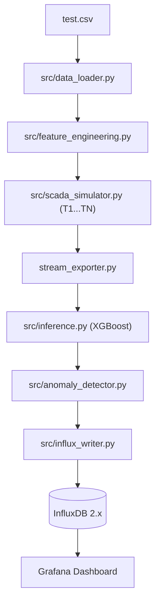

# SCADA Edge – Wind Turbine Anomaly Detection

Hệ thống giám sát biên (Edge Computing) phát hiện bất thường công suất phát của turbine gió từ dữ liệu SCADA theo thời gian thực.

---

## Mục lục

1. [Hệ thống làm gì?](#1-hệ-thống-làm-gì)
2. [Chức năng các module & Luồng gọi nhau](#2-chức-năng-các-module--luồng-gọi-nhau)
3. [Chức năng các file cấu hình](#3-chức-năng-các-file-cấu-hình)
4. [Dữ liệu ghi vào InfluxDB (Schema)](#4-dữ-liệu-ghi-vào-influxdb)
5. [Hướng dẫn cài đặt & Cách chạy](#5-hướng-dẫn-cài-đặt--cách-chạy)
6. [Kiểm thử hệ thống (Unit Testing Guide)](#6-kiểm-thử-hệ-thống)
7. [Sổ tay kịch bản chạy SCADA Simulator và kiểm tra lỗi](#7-sổ-tay-kịch-bản-chạy-scada-simulator-và-kiểm-tra-lỗi)
8. [Cách đối chiếu dữ liệu & Bộ đếm (Stream Summary)](#8-cách-đối-chiếu-dữ-liệu--bộ-đếm)
9. [Checklist sau mỗi kịch bản thử nghiệm](#9-checklist-sau-mỗi-kịch-bản-thử-nghiệm)
10. [Thiết lập Grafana & Truy vấn Flux](#10-thiết-lập-grafana--truy-vấn-flux)
11. [Các lưu ý quan trọng](#11-các-lưu-ý-quan-trọng)
12. [Thí nghiệm giới hạn pipeline trực tiếp](#12-thí-nghiệm-giới-hạn-pipeline-trực-tiếp)

---

## 1. Hệ thống làm gì?

Hệ thống thực hiện toàn bộ quy trình phát hiện bất thường công suất turbine gió qua các bước:

1. **Đọc dữ liệu**: Nạp dữ liệu cảm biến chuỗi thời gian từ file `test.csv`.
2. **Tạo feature thời gian**: Trích xuất các đặc trưng chu kỳ lượng giác 24 giờ (`Day_sin`, `Day_cos`) và 12 tháng (`Month_sin`, `Month_cos`).
3. **Mô phỏng đa turbine**: `SCADA Simulator` mô phỏng nhiều turbine ($T_1, T_2, \dots, T_N$) phát dữ liệu liên tục theo tốc độ cấu hình với các kịch bản (`normal`, `burst`, `anomaly_injection`).
4. **Dự đoán công suất**: Chuẩn hóa 7 đặc trưng qua `StandardScaler` (`scaler.joblib`) và dự đoán công suất kỳ vọng bằng mô hình `XGBoost` (`xgboost_model.json`).
5. **Phát hiện bất thường**: Tính sai số chênh lệch $\text{residual} = |P_{actual} - P_{predicted}|$, so sánh với ngưỡng `anomaly_threshold` để gắn cờ `anomaly_flag` (1 nếu vượt ngưỡng, 0 nếu an toàn).
6. **Lưu trữ chuỗi thời gian**: Ghi kết quả đo lường và dự đoán vào `InfluxDB` theo từng `turbine_id`.
7. **Trực quan hóa**: `Grafana` đọc dữ liệu từ `InfluxDB` để vẽ biểu đồ và cảnh báo theo thời gian thực.

### Sơ đồ luồng xử lý:

```text
test.csv
→ Data Loader
→ Feature Engineering
→ SCADA Simulator (T1...TN)
→ XGBoost Inference
→ Anomaly Detector
→ InfluxDB
→ Grafana
```



---

## 2. Chức năng các module & Luồng gọi nhau

| Module / Tệp tin | Chức năng chính |
|---|---|
| [`stream_exporter.py`](file:///d:/SCDA_Edge/stream_exporter.py) | **Entry Point**: File chạy chính, điều phối toàn bộ pipeline, nạp cấu hình, khởi tạo mô hình/writer một lần duy nhất, nhận stream event, gọi dự đoán, phát hiện bất thường, ghi InfluxDB, in log chi tiết và bảng tổng kết khi kết thúc hoặc dừng bằng `Ctrl+C`. |
| [`config/settings.py`](file:///d:/SCDA_Edge/config/settings.py) | Quản lý nạp cấu hình từ `.env` ([`InfluxSettings`](file:///d:/SCDA_Edge/config/settings.py#L22)), `config.json` ([`load_config`](file:///d:/SCDA_Edge/config/settings.py#L101)) và `config/simulator.json` ([`SimulatorSettings`](file:///d:/SCDA_Edge/config/settings.py#L68), [`load_simulator_settings`](file:///d:/SCDA_Edge/config/settings.py#L111)); kiểm tra và validate chặt chẽ kiểu dữ liệu/khoảng giá trị. |
| [`src/data_loader.py`](file:///d:/SCDA_Edge/src/data_loader.py) | Đọc file CSV, xóa các dòng thiếu (`dropna()`), kiểm tra sự tồn tại của các cột bắt buộc (`Date/Time`, features, target) và chuyển đổi định dạng ngày giờ chuẩn. |
| [`src/feature_engineering.py`](file:///d:/SCDA_Edge/src/feature_engineering.py) | Hàm [`add_time_features()`](file:///d:/SCDA_Edge/src/feature_engineering.py#L5) tạo 4 đặc trưng chu kỳ thời gian `Day_sin`, `Day_cos`, `Month_sin`, `Month_cos` từ cột `Date/Time` mà không làm thay đổi DataFrame gốc. |
| [`src/scada_simulator.py`](file:///d:/SCDA_Edge/src/scada_simulator.py) | Lớp [`SCADASimulator`](file:///d:/SCDA_Edge/src/scada_simulator.py#L23) mô phỏng nhiều turbine $T_1 \dots T_N$, duy trì con trỏ dữ liệu độc lập cho từng turbine theo cơ chế round-robin, điều tiết tốc độ phát chính xác theo deadline scheduling. |
| [`src/simulation_scenarios.py`](file:///d:/SCDA_Edge/src/simulation_scenarios.py) | Xử lý logic thuần cho 3 kịch bản: `normal` (giữ nguyên), `burst` (thay đổi tốc độ), `anomaly_injection` (nhân công suất thực tế theo xác suất và hệ số nhân với random seed). |
| [`src/inference.py`](file:///d:/SCDA_Edge/src/inference.py) | Lớp [`PowerPredictor`](file:///d:/SCDA_Edge/src/inference.py#L8) nạp scaler (`scaler.joblib`) và mô hình XGBoost (`xgboost_model.json`) một lần duy nhất vào bộ nhớ, cung cấp hàm `predict()` cho từng mẫu dữ liệu. |
| [`src/anomaly_detector.py`](file:///d:/SCDA_Edge/src/anomaly_detector.py) | Hàm [`detect_anomaly()`](file:///d:/SCDA_Edge/src/anomaly_detector.py#L1) tính toán sai số $\text{residual} = |P_{actual} - P_{predicted}|$ và gán nhãn `anomaly_flag` (1 nếu residual > threshold, ngược lại 0). |
| [`src/influx_writer.py`](file:///d:/SCDA_Edge/src/influx_writer.py) | Lớp [`InfluxWriter`](file:///d:/SCDA_Edge/src/influx_writer.py#L6) kết nối InfluxDB client và ghi các bản ghi đo lường (`turbine_id`, các field) theo chuẩn Line Protocol đồng bộ. |
| [`tests/`](file:///d:/SCDA_Edge/tests/) | Bộ kiểm thử tự động toàn diện (44 unit tests) kiểm tra độc lập từng module và luồng liên kết mà không cần kết nối InfluxDB thật. |

### Cách các module gọi nhau trong pipeline:
1. `stream_exporter.py` gọi `config/settings.py` để lấy cấu hình kết nối, mô hình và simulator.
2. `stream_exporter.py` gọi `src/data_loader.py` để đọc dữ liệu thô, sau đó chuyển sang `src/feature_engineering.py` để sinh 4 đặc trưng thời gian.
3. `stream_exporter.py` khởi tạo `PowerPredictor` (`src/inference.py`) và `InfluxWriter` (`src/influx_writer.py`) một lần duy nhất.
4. `stream_exporter.py` khởi tạo `SCADASimulator` (`src/scada_simulator.py`). Trong mỗi vòng lặp phát dữ liệu, simulator gọi `src/simulation_scenarios.py` để áp dụng kịch bản và yield từng `SimulationEvent`.
5. `stream_exporter.py` nhận `SimulationEvent`, gọi `PowerPredictor.predict()` $\to$ gọi `detect_anomaly()` $\to$ gọi `InfluxWriter.write_turbine_status()` $\to$ cập nhật bộ đếm và in log.

---

## 3. Chức năng các file cấu hình

| Tệp cấu hình | Mục đích & Ý nghĩa |
|---|---|
| `.env` | Chứa token bảo mật và các tham số kết nối InfluxDB thực tế tại máy chạy. File này được liệt kê trong `.gitignore` và **không được đưa lên Git**. |
| `.env.example` | File mẫu an toàn (không chứa credential thật) dùng để sao chép thành `.env` khi cài đặt dự án. |
| `config.json` | Chứa ngưỡng phát hiện bất thường (`anomaly_threshold`), chỉ số đánh giá (`mae`, `rmse`), danh sách 7 `features` đầu vào và tên cột mục tiêu `target`. |
| `config/simulator.json` | Cấu hình toàn bộ tham số vận hành của SCADA Simulator (số turbine, tốc độ, kịch bản, burst, anomaly injection). |
| `docker-compose.yml` | Khởi chạy cụm dịch vụ InfluxDB 2.7 (cổng 8086) và Grafana (cổng 3000) cùng phân vùng lưu trữ bền vững. |
| `requirements.txt` | Khai báo danh sách các thư viện Python cần thiết (`xgboost`, `scikit-learn`, `influxdb-client`, `pytest`...). |

### Giải thích các key trong `config/simulator.json`:

```json
{
  "enabled": true,
  "turbine_count": 5,
  "events_per_second": 5,
  "loop_data": false,
  "max_events": null,
  "scenario": "normal",
  "random_seed": 42,
  "burst": {
    "start_after_seconds": 10,
    "duration_seconds": 10,
    "multiplier": 5
  },
  "anomaly_injection": {
    "probability": 0.05,
    "actual_power_multiplier": 1.8
  }
}
```

- **`enabled`**: Bật (`true`) hoặc tắt (`false`) SCADA Simulator. Khi `false`, hệ thống chạy chế độ 1 turbine truyền thống.
- **`turbine_count`**: Tổng số lượng turbine mô phỏng (sinh ID từ `T1` tới $T_N$).
- **`events_per_second`**: **Tổng tốc độ phát của toàn bộ simulator** (Ví dụ: `turbine_count = 5` và `events_per_second = 10` nghĩa là toàn hệ thống phát 10 event/giây, không phải 50 event/giây).
- **`loop_data`**: `true` = quay lại dòng đầu khi đọc hết dữ liệu CSV; `false` = dừng lại sau khi mỗi turbine đọc hết dữ liệu.
- **`max_events`**: Giới hạn tổng số event sinh ra (`null` nghĩa là không giới hạn).
- **`scenario`**: Kịch bản mô phỏng, nhận một trong 3 giá trị: `"normal"`, `"burst"`, hoặc `"anomaly_injection"`.
- **`burst`**: Cấu hình chế độ tăng tải đột biến:
  - `start_after_seconds`: Thời gian chạy tốc độ thường trước khi burst.
  - `duration_seconds`: Thời lượng diễn ra burst.
  - `multiplier`: Hệ số tăng tốc độ trong burst.
- **`anomaly_injection`**: Cấu hình chèn bất thường:
  - `probability`: Xác suất chèn bất thường vào mỗi event ($[0.0, 1.0]$).
  - `actual_power_multiplier`: Hệ số nhân vào công suất thực tế khi chèn.

---

## 4. Dữ liệu ghi vào InfluxDB

Dữ liệu được ghi vào InfluxDB bucket `turbine_metrics` theo cấu trúc:

- **Measurement**: `turbine_status`
- **Tag**: `turbine_id` (được đánh chỉ mục để lọc và nhóm theo từng turbine: `T1`, `T2`, ..., $T_N$)
- **Fields**:
  - `wind_speed`: Tốc độ gió đo được ($m/s$, kiểu Float).
  - `actual_power`: Công suất thực tế phát lên lưới ($kW$, kiểu Float).
  - `predicted_power`: Công suất dự đoán từ XGBoost ($kW$, kiểu Float).
  - `residual`: Sai số chênh lệch tuyệt đối $|P_{actual} - P_{predicted}|$ ($kW$, kiểu Float).
  - `anomaly_flag`: Cờ cảnh báo bất thường (`0`: Bình thường, `1`: Bất thường, kiểu Integer).
- **Timestamp**: Thời gian ghi nhận bản ghi (độ chính xác nano giây).

---

## 5. Hướng dẫn cài đặt & Cách chạy

### Bước 1: Chuẩn bị môi trường & Cài đặt thư viện
```powershell
cd D:\SCDA_Edge
python -m venv .venv
.\.venv\Scripts\python.exe -m pip install -r requirements.txt
```

### Bước 2: Tạo và cấu hình file `.env`
Sao chép từ file mẫu:
```powershell
Copy-Item .env.example .env
```
Mở `.env` và điền `INFLUX_TOKEN` hợp lệ do InfluxDB cấp:
```dotenv
INFLUX_URL=http://localhost:8086
INFLUX_TOKEN=replace_with_your_token
INFLUX_ORG=scada_org
INFLUX_BUCKET=turbine_metrics
TURBINE_ID=T1
STREAM_INTERVAL_SECONDS=1
SIMULATOR_ENABLED=true
```

### Bước 3: Khởi chạy InfluxDB & Grafana
```powershell
docker compose up -d
```

### Bước 4: Chạy kiểm thử tự động
```powershell
.\.venv\Scripts\python.exe -m pytest -q -p no:cacheprovider
```

### Bước 5: Khởi chạy Stream Exporter
```powershell
.\.venv\Scripts\python.exe stream_exporter.py
```

Nhấn `Ctrl + C` bất cứ lúc nào để dừng chương trình an toàn và xem bảng tổng kết.

---

## 6. Kiểm thử hệ thống

### 6.1 Tổng quan các lớp test

Bộ kiểm thử Unit Test trong dự án được thiết kế hoàn toàn độc lập:
- Không cần InfluxDB thật hay Grafana đang chạy.
- Không tải model thật trong các bài test logic điều phối.
- Sử dụng fake clock/sleep/writer để kiểm tra timing mà không làm chậm tốc độ chạy test.

### Bảng tổng hợp các file test:

| File test | Thành phần được kiểm tra | Có dùng InfluxDB thật? | Mục tiêu |
|---|---|:---:|---|
| [`tests/test_anomaly_detector.py`](file:///d:/SCDA_Edge/tests/test_anomaly_detector.py) | `src.anomaly_detector.detect_anomaly` | Không | Kiểm tra công thức tính `residual`, so khớp ngưỡng `anomaly_threshold`, và kiểu dữ liệu trả về. |
| [`tests/test_feature_engineering.py`](file:///d:/SCDA_Edge/tests/test_feature_engineering.py) | `src.feature_engineering.add_time_features` | Không | Kiểm tra trích xuất 4 đặc trưng lượng giác chu kỳ ngày/tháng, tính bất biến của DataFrame gốc và bắt lỗi. |
| [`tests/test_scada_simulator.py`](file:///d:/SCDA_Edge/tests/test_scada_simulator.py) | `src.scada_simulator.SCADASimulator` | Không | Kiểm tra turbine ID, phân phối round-robin, con trỏ độc lập, `loop_data`, `max_events`, rate limiting, burst multiplier và parse `.env`. |
| [`tests/test_simulation_scenarios.py`](file:///d:/SCDA_Edge/tests/test_simulation_scenarios.py) | `src.simulation_scenarios` | Không | Kiểm tra các kịch bản `normal`, `burst`, `anomaly_injection` (xác suất, hệ số nhân, tính tái lập seed). |
| [`tests/test_stream_orchestration.py`](file:///d:/SCDA_Edge/tests/test_stream_orchestration.py) | `stream_exporter.process_event`, `create_legacy_stream` | Không | Kiểm tra định tuyến `turbine_id` tới writer, cập nhật bộ đếm thành công/thất bại và định dạng log. |
| [`tests/__init__.py`](file:///d:/SCDA_Edge/tests/__init__.py) | Package Marker | Không | Không chứa test case; giúp Python và pytest nhận diện thư mục `tests` như một Python package. |

---

### 6.2 Chi tiết từng module kiểm thử

- **`tests/test_anomaly_detector.py`** (5 tests):
  $$\text{residual} = |P_{actual} - P_{predicted}|, \quad \text{anomaly\_flag} = 1 \text{ nếu } \text{residual} > \text{threshold else } 0$$
  Kiểm tra các trường hợp: dưới ngưỡng ($\to 0$), trên ngưỡng ($\to 1$), bằng ngưỡng ($\to 0$ do dùng toán tử $>$), độ lệch âm vẫn cho residual dương, và kiểm tra kiểu dữ liệu trả về (`float`, `int`).
  ```powershell
  .\.venv\Scripts\python.exe -m pytest tests\test_anomaly_detector.py -v -p no:cacheprovider
  ```

- **`tests/test_feature_engineering.py`** (7 tests):
  Kiểm tra sinh đủ 4 cột `Day_sin`, `Day_cos`, `Month_sin`, `Month_cos`, độ chính xác tại `00:00`, `06:00`, `12:00`, `18:00`, các tháng 3, 6, 9, tính bất biến của DataFrame nguồn và bắt lỗi thiếu/sai kiểu `Date/Time`.
  ```powershell
  .\.venv\Scripts\python.exe -m pytest tests\test_feature_engineering.py -v -p no:cacheprovider
  ```

- **`tests/test_scada_simulator.py`** (15 tests):
  Kiểm tra tạo turbine ID `T1...TN`, phân phối round-robin với con trỏ độc lập:
  ```text
  T1 row 0 → T2 row 0 → T3 row 0 → T1 row 1 → T2 row 1 → T3 row 1...
  ```
  Kiểm tra `loop_data`, `max_events`, tính bất biến của DataFrame gốc, độc lập giữa các event row, seed tái lập, interval tốc độ thường, multiplier trong burst, không sleep số âm, và tốc độ tổng `events_per_second`.
  ```powershell
  .\.venv\Scripts\python.exe -m pytest tests\test_scada_simulator.py -v -p no:cacheprovider
  ```

- **`tests/test_simulation_scenarios.py`** (12 tests):
  Kiểm tra `normal` (không đổi), `burst` (không đổi measurement), `anomaly_injection` (probability 0.0 không inject, probability 1.0 luôn inject, nhân đúng target, giữ nguyên feature khác, seed tái lập) và bắt lỗi scenario không hợp lệ.
  ```powershell
  .\.venv\Scripts\python.exe -m pytest tests\test_simulation_scenarios.py -v -p no:cacheprovider
  ```

- **`tests/test_stream_orchestration.py`** (5 tests):
  Kiểm tra `turbine_id` từ `SimulationEvent` được truyền nguyên vẹn sang InfluxWriter, cập nhật đúng các bộ đếm `events_generated`, `events_processed`, `influx_write_success`, `influx_write_failed` khi có lỗi, chuỗi log chứa `Injected=True`, và chế độ legacy mode khi tắt simulator.
  ```powershell
  .\.venv\Scripts\python.exe -m pytest tests\test_stream_orchestration.py -v -p no:cacheprovider
  ```

---

### 6.3 Các lệnh test hữu ích

```powershell
# Chạy toàn bộ 44 tests ngắn gọn
.\.venv\Scripts\python.exe -m pytest -q -p no:cacheprovider

# Chạy toàn bộ 44 tests chi tiết từng test
.\.venv\Scripts\python.exe -m pytest -v -p no:cacheprovider

# Dừng ngay tại lỗi đầu tiên
.\.venv\Scripts\python.exe -m pytest -x -v -p no:cacheprovider

# Chạy các test liên quan tới burst
.\.venv\Scripts\python.exe -m pytest -k "burst" -v -p no:cacheprovider

# Chạy các test liên quan tới anomaly
.\.venv\Scripts\python.exe -m pytest -k "anomaly" -v -p no:cacheprovider
```

---

## 7. Sổ tay kịch bản chạy SCADA Simulator và kiểm tra lỗi

> [!CAUTION]
> **Sao lưu trước khi thử nghiệm:**
> ```powershell
> Copy-Item config\simulator.json config\simulator.backup.json
> ```
> Sau khi thử nghiệm xong, khôi phục lại cấu hình mặc định:
> ```powershell
> Copy-Item config\simulator.backup.json config\simulator.json -Force
> ```

### Kịch bản 1 — Normal, 5 turbine
- **Cấu hình `config/simulator.json`**:
  ```json
  {
    "enabled": true,
    "turbine_count": 5,
    "events_per_second": 5,
    "loop_data": false,
    "max_events": 25,
    "scenario": "normal"
  }
  ```
- **Ý nghĩa**: Phát dữ liệu cho 5 turbine với tốc độ tổng 5 event/giây, dừng sau 25 event (mỗi turbine có 5 event).

### Kịch bản 2 — Quy mô 20 turbines
- **Cấu hình**: `"turbine_count": 20`, `"events_per_second": 20`, `"max_events": 100`, `"scenario": "normal"`.
- **Ý nghĩa**: Kiểm tra quản lý định danh turbine mở rộng từ `T1` đến `T20`.

### Kịch bản 3 — Chèn bất thường ngẫu nhiên (20% xác suất)
- **Cấu hình**: `"scenario": "anomaly_injection"`, `"random_seed": 42`, `"anomaly_injection": {"probability": 0.2, "actual_power_multiplier": 3.0}`, `"max_events": 100`.
- **Ý nghĩa**: Khoảng 20% event bị nhân công suất thực tế lên 3.0 lần và đánh dấu `Injected=True` trên terminal.

### Kịch bản 4 — Bắt buộc chèn bất thường vào mọi event (100%)
- **Cấu hình**: `"scenario": "anomaly_injection"`, `"random_seed": 42`, `"anomaly_injection": {"probability": 1.0, "actual_power_multiplier": 5.0}`, `"max_events": 30`.
- **Ý nghĩa**: Toàn bộ 30 event đều có `Injected=True` và hầu hết kích hoạt `Cảnh báo 1`.

### Kịch bản 5 — Tải đột biến theo chu kỳ (Burst Traffic)
- **Cấu hình**: `"scenario": "burst"`, `"events_per_second": 20`, `"burst": {"start_after_seconds": 3, "duration_seconds": 5, "multiplier": 10}`, `"max_events": 300`.
- **Ý nghĩa**: Tốc độ tăng từ 20 lên $20 \times 10 = 200\text{ event/giây}$ trong khoảng giây thứ 3 đến giây thứ 8 mà không làm mất hay nhân đôi dữ liệu.

### Kịch bản 6 — Tải rất cao để quan sát giới hạn pipeline (Stress Test)
- **Cấu hình**: `"events_per_second": 1000`, `"max_events": 5000`, `"scenario": "normal"`.
- **Đo thời gian bằng PowerShell**:
  ```powershell
  Measure-Command { .\.venv\Scripts\python.exe stream_exporter.py }
  ```
- **Ý nghĩa**: Quan sát throughput thực tế $= \text{Influx success} / \text{Tổng thời gian}$.

### Kịch bản 7 — Cấu hình tốc độ không hợp lệ (`events_per_second = 0`)
- **Cấu hình**: `"events_per_second": 0`.
- **Kết quả**: Báo lỗi `ValueError` ngay tại bước nạp cấu hình và dừng an toàn trước khi chạy.

### Kịch bản 8 — Tên Scenario không tồn tại
- **Cấu hình**: `"scenario": "unknown_scenario"`.
- **Kết quả**: Báo lỗi `ValueError: Trường 'scenario' không hợp lệ`.

### Kịch bản 9 — Token InfluxDB không hợp lệ (401 Unauthorized)
- **Thực hiện**: Đặt trong `.env`: `INFLUX_TOKEN=invalid_token_for_testing_only`.
- **Kết quả**: InfluxDB từ chối ghi với lỗi `401 Unauthorized`, `Influx failed` tăng lên 1, pipeline dừng an toàn và in bảng tổng kết. Khôi phục lại token đúng sau khi kiểm tra.

### Kịch bản 10 — InfluxDB bị dừng đột ngột
- **Thực hiện**: `docker compose stop influxdb` rồi chạy `stream_exporter.py`.
- **Kết quả**: Báo lỗi kết nối, `Influx failed` tăng lên 1, đóng writer và in summary. Khởi động lại bằng `docker compose start influxdb`.

### Kịch bản 11 — Dừng thủ công bằng `Ctrl + C`
- **Thực hiện**: Chạy chương trình với `"loop_data": true`, sau vài giây nhấn `Ctrl + C`.
- **Kết quả**: Bắt `KeyboardInterrupt`, in bảng tổng kết và đóng kết nối sạch sẽ.

### Kịch bản 12 — Tắt Simulator chạy Legacy Single-Turbine Mode
- **Thực hiện**: Đặt trong `.env`: `SIMULATOR_ENABLED=false`.
- **Kết quả**: Chạy 1 turbine duy nhất theo `TURBINE_ID` và `STREAM_INTERVAL_SECONDS`.

---

## 8. Cách đối chiếu dữ liệu & Bộ đếm

### Mối quan hệ giữa các bộ đếm trong pipeline:

```text
Trạng thái hoàn hảo:  Generated = Processed = Influx success (Influx failed = 0)
Lỗi suy luận:        Generated > Processed
Lỗi InfluxDB:        Processed > Influx success (Influx failed > 0)
```

- **`Generated`**: Tổng số event simulator đã sinh ra.
- **`Processed`**: Tổng số event đã hoàn tất bước suy luận và phát hiện bất thường.
- **`Influx success`**: Số event ghi thành công vào InfluxDB.
- **`Influx failed`**: Số event thất bại khi ghi InfluxDB (kích hoạt fail-fast dừng pipeline).
- **`Injected anomalies`**: Số event được cố ý chèn sai lệch công suất thực tế.
- **`Detected anomalies`**: Số event có sai số vượt ngưỡng $\text{residual} > 1942.07\text{ kW}$.

### Bảng đối chiếu hiện tượng và kết luận:

| Hiện tượng quan sát | Kết luận kỹ thuật |
|---|---|
| `Injected anomalies` tăng | Simulator đã cố ý nhân công suất thực tế theo kịch bản `anomaly_injection`. |
| `Detected anomalies` tăng | Sai số $|\text{actual} - \text{predicted}|$ thực tế vượt ngưỡng `anomaly_threshold`. |
| `Influx success == Generated` | Toàn bộ event sinh ra đã được ghi đầy đủ vào InfluxDB (không mất dữ liệu ở tầng ứng dụng). |
| `Influx failed > 0` | Xảy ra lỗi kết nối mạng, sai token hoặc InfluxDB từ chối ghi. |
| Thời gian chạy lâu hơn mục tiêu | Pipeline đạt throughput tối đa của client ghi đồng bộ (bình thường trong Giai đoạn 2). |
| Lỗi `401 Unauthorized` | API Token sai, hết hạn hoặc thiếu quyền `Write` vào bucket `turbine_metrics`. |
| Lỗi `Connection refused` | Container InfluxDB chưa được khởi chạy hoặc sai địa chỉ `INFLUX_URL`. |
| Lỗi `ValueError` trước khi chạy | Cấu hình trong `config/simulator.json` bị lớp validation từ chối vì sai kiểu dữ liệu hoặc khoảng giá trị. |

---

## 9. Checklist sau mỗi kịch bản thử nghiệm

- [ ] Đã đặt `max_events` trước khi chạy để tránh stream vô hạn.
- [ ] Đã lưu lại file `config/simulator.json`.
- [ ] Kiểm tra Docker / InfluxDB container đang chạy (`docker compose ps`).
- [ ] Chạy `stream_exporter.py` và theo dõi log `turbine_id`.
- [ ] Đọc bảng `SCADA STREAM SUMMARY` khi hoàn thành.
- [ ] So sánh `Generated` vs `Processed` vs `Influx success` vs `Influx failed`.
- [ ] Kiểm tra phân nhóm theo `turbine_id` trên InfluxDB Data Explorer nếu cần.
- [ ] Khôi phục `config/simulator.json` về cấu hình chuẩn mặc định.
- [ ] Đảm bảo không commit `.env` hoặc file backup chứa thông tin nhạy cảm.

### Cấu hình chuẩn mặc định để khôi phục (`config/simulator.json`):

```json
{
  "enabled": true,
  "turbine_count": 5,
  "events_per_second": 5,
  "loop_data": false,
  "max_events": null,
  "scenario": "normal",
  "random_seed": 42,
  "burst": {
    "start_after_seconds": 10,
    "duration_seconds": 10,
    "multiplier": 5
  },
  "anomaly_injection": {
    "probability": 0.05,
    "actual_power_multiplier": 1.8
  }
}
```

---

## 10. Thiết lập Grafana & Truy vấn Flux

### Lọc dữ liệu theo `turbine_id` trong InfluxDB Flux Query

Truy vấn dữ liệu của một turbine cụ thể (`T1`):
```flux
from(bucket: "turbine_metrics")
  |> range(start: -1h)
  |> filter(fn: (r) => r["_measurement"] == "turbine_status")
  |> filter(fn: (r) => r["turbine_id"] == "T1")
  |> filter(fn: (r) => r["_field"] == "actual_power" or r["_field"] == "predicted_power")
```

Truy vấn phân nhóm so sánh toàn bộ các turbine trên Grafana:
```flux
from(bucket: "turbine_metrics")
  |> range(start: -15m)
  |> filter(fn: (r) => r["_measurement"] == "turbine_status")
  |> filter(fn: (r) => r["_field"] == "residual")
  |> group(columns: ["turbine_id"])
```

---

## 11. Các lưu ý quan trọng

1. **SCADA Simulator chạy tuần tự round-robin**: Simulator hiện tại phát dữ liệu tuần tự theo chu kỳ round-robin giữa các turbine trên một luồng chính, chưa phải đa luồng hay đa tiến trình song song.
2. **Chưa có Apache Kafka và Apache Spark**: Hệ thống hiện tại đang ở **Giai đoạn 2** (SCADA Simulator phát trực tiếp tới pipeline Python). Tầng đệm Message Broker (Kafka) và tính toán phân tán (Spark Structured Streaming) là mục tiêu của các giai đoạn tiếp theo.
3. **Giới hạn của Synchronous InfluxDB Writer**: Client InfluxDB ghi đồng bộ từng điểm đo qua HTTP. Khi gặp tải cao (burst hoặc `events_per_second` lớn), tốc độ phát thực tế có thể chậm hơn tốc độ cấu hình do nghẽn I/O mạng, nhưng không làm mất dữ liệu nếu `Influx success == Generated`.
4. **Phân biệt `Injected anomalies` và `Detected anomalies`**: `Injected anomalies` là số lần simulator cố ý sửa công suất thực tế; `Detected anomalies` là số lần sai số vượt ngưỡng `anomaly_threshold`. Hai con số này không bắt buộc bằng nhau.
5. **Dừng an toàn & Giới hạn sự kiện**: Nhấn `Ctrl + C` để dừng chương trình bất kỳ lúc nào. Khi chạy thử nghiệm, luôn khuyến nghị đặt `max_events` (ví dụ `25` hoặc `100`) để chương trình tự kết thúc và dễ dàng đối chiếu bộ đếm.
6. **Bảo mật Credentials**: Tuyệt đối không commit file `.env` chứa token thật lên Git.

---

## 12. Thí nghiệm giới hạn pipeline trực tiếp

Xem hướng dẫn tại [Direct Pipeline Loss Experiment](experiments/README.md).
