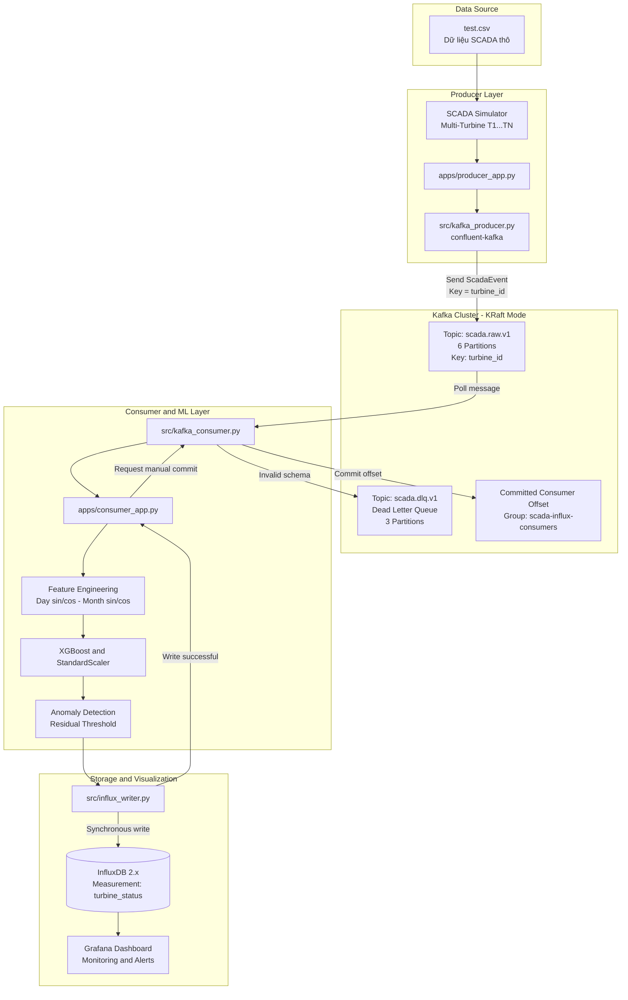

# SCADA Edge – Wind Turbine Anomaly Detection với Apache Kafka

Hệ thống giám sát biên (Edge Computing) tích hợp **Apache Kafka**, mô hình học máy **XGBoost** và cơ sở dữ liệu chuỗi thời gian **InfluxDB** để phát hiện bất thường công suất phát của tuabin gió theo thời gian thực.

---

## Mục lục

1. [Vấn đề bài toán & Vì sao cần Apache Kafka?](#1-vấn-đề-bài-toán--vì-sao-cần-apache-kafka)
2. [So sánh kiến trúc Trước và Sau](#2-so-sánh-kiến-trúc-trước-và-sau)
3. [Kiến trúc hệ thống chi tiết](#3-kiến-trúc-hệ-thống-chi-tiết)
4. [Chức năng từng module trong dự án](#4-chức-năng-từng-module-trong-dự-án)
5. [Đặc tả dữ liệu (Event Schema)](#5-đặc-tả-dữ-liệu-event-schema)
6. [Kafka Topic, Partition, Message Key & Offset](#6-kafka-topic-partition-message-key--offset)
7. [Cơ chế phân phối dữ liệu (Delivery Semantics)](#7-cơ-chế-phân-phối-dữ-liệu-delivery-semantics)
8. [Cấu hình hệ thống](#8-cấu-hình-hệ-thống)
9. [Hướng dẫn cài đặt & Chạy hệ thống](#9-hướng-dẫn-cài-đặt--chạy-hệ-thống)
10. [Hướng dẫn kiểm thử (Unit & Integration Tests)](#10-hướng-dẫn-kiểm-thử-unit--integration-tests)
11. [Sổ tay thử nghiệm & Kiểm tra lỗi (Failure Scenarios)](#11-sổ-tay-thử-nghiệm--kiểm-tra-lỗi-failure-scenarios)
12. [Các chỉ số (Metrics) & Bộ đếm cần theo dõi](#12-các-chỉ-số-metrics--bộ-đếm-cần-theo-dõi)
13. [Giới hạn kỹ thuật & Lộ trình phát triển (Roadmap)](#13-giới-hạn-kỹ-thuật--lộ-trình-phát-triển-roadmap)

---

## 1. Vấn đề bài toán & Vì sao cần Apache Kafka?

### Bối cảnh
Trong các nông trại điện gió hiện đại, hàng chục đến hàng trăm tuabin gió (SCADA nodes) liên tục tạo ra dữ liệu cảm biến đo đạc (tốc độ gió, hướng gió, công suất lý thuyết, công suất thực tế...) với tần suất cao. Việc phát hiện sớm các bất thường công suất (do lỗi hộp số, bám băng cánh quạt, hoặc cảm biến hỏng) giúp ngăn ngừa sự cố nghiêm trọng và giảm chi phí bảo trì.

### Hạn chế của Pipeline trực tiếp trước đây (`stream_exporter.py`)
Ở kiến trúc cũ, chương trình mô phỏng SCADA kết nối trực tiếp với luồng suy luận XGBoost và ghi ngay vào InfluxDB:
```text
SCADA Simulator ──(Trực tiếp / Đồng bộ)──> XGBoost ──> InfluxDB ──> Grafana
```
- **Khớp nối chặt chẽ (Tight Coupling):** Bộ phát dữ liệu bị ràng buộc với tốc độ xử lý của mô hình ML và tốc độ ghi của InfluxDB.
- **Không có đệm bền vững (No Durable Buffering):** Khi lượng dữ liệu tăng đột biến (Burst load), tốc độ sinh dữ liệu vượt quá tốc độ suy luận hoặc ghi DB, gây nghẽn bộ nhớ máy chủ biên.
- **Rủi ro mất dữ liệu khi DB Outage:** Nếu InfluxDB gặp sự cố mạng hoặc restart, toàn bộ luồng phát phải dừng lại hoặc hủy bỏ các event chưa ghi; không có khả năng lưu trữ hàng đợi để xử lý bù.
- **Không thể Replay:** Khi cần chạy lại mô hình hoặc kiểm tra lại chuỗi dữ liệu trong quá khứ, pipeline trực tiếp không thể phát lại chính xác thứ tự dữ liệu thô.

### Giải pháp với Apache Kafka
Apache Kafka đóng vai trò là một **Distributed Streaming Platform / Message Broker**:
- **Tách rời Producer và Consumer (Decoupling):** Producer (SCADA Simulator) chỉ việc đẩy dữ liệu vào Kafka topic với độ trễ cực thấp. Consumer (ML Engine) chủ động poll và xử lý theo khả năng.
- **Đệm dữ liệu bền vững (Durable Backlog):** Dữ liệu được lưu trữ trên ổ đĩa của Kafka theo partition, đảm bảo an toàn tuyệt đối khi Consumer hoặc InfluxDB tạm thời ngừng hoạt động.
- **Theo dõi Consumer Lag:** Giúp giám sát độ trễ tích lũy giữa tốc độ sản xuất và tốc độ tiêu thụ dữ liệu.
- **Offset Tracking & Replay:** Lưu vết chính xác vị trí đã xử lý của từng consumer group, hỗ trợ phát lại dữ liệu khi cần phân tích lại.

> [!NOTE]
> **Lưu ý về hiệu năng:** Kafka không làm thuật toán XGBoost chạy nhanh hơn, mà Kafka cung cấp cơ chế **Durable Buffering, Offset Management, Fault Tolerance** và **Scalability** cho toàn bộ hệ thống.

---

## 2. So sánh kiến trúc Trước và Sau

```text
Kiến trúc cũ (Direct Pipeline):
[test.csv] ──> [SCADA Simulator] ──> [Feature Engineering] ──> [XGBoost] ──> [InfluxDB] ──> [Grafana]

Kiến trúc mới (Kafka Decoupled Pipeline):
[test.csv] ──> [SCADA Simulator] ──> [Kafka Producer]
                                            │
                                            ▼
                                   [Kafka: scada.raw.v1] ──(Lỗi schema)──> [Kafka: scada.dlq.v1]
                                            │
                                            ▼
                                   [Kafka Consumer]
                                            │
                                            ▼
                               [Feature Engineering (Sin/Cos)]
                                            │
                                            ▼
                                   [XGBoost Inference]
                                            │
                                            ▼
                                   [Anomaly Detection]
                                            │
                                            ▼
                                   [InfluxDB (Tags & Fields)]
                                            │
                                            ▼
                                   [Grafana Dashboard]
```

### Bảng so sánh chi tiết

| Tiêu chí | Pipeline trực tiếp (`stream_exporter.py`) | Pipeline Kafka (`apps/producer_app.py` & `apps/consumer_app.py`) |
|---|---|---|
| **Khớp nối (Coupling)** | Đồng bộ, chặt chẽ (Producer phải đợi DB write). | Bất đồng bộ, hoàn toàn tách rời giữa sinh và xử lý dữ liệu. |
| **Đệm dữ liệu (Buffering)** | Chỉ có in-memory buffer tạm thời của tiến trình. | Bền vững trên đĩa (Durable Disk Storage) của Kafka Broker. |
| **Khả năng chịu lỗi DB** | InfluxDB lỗi $\to$ Pipeline dừng hoặc mất dữ liệu. | InfluxDB lỗi $\to$ Kafka giữ backlog; Consumer retry backoff, không mất message. |
| **Quản lý vị trí đọc (Offset)** | Không có; chỉ duyệt vòng lặp dòng. | Quản lý Offset chính xác theo từng partition và Consumer Group. |
| **Giám sát Consumer Lag** | Không hỗ trợ. | Đo lường chính xác qua `kafka-consumer-groups`. |
| **Khả năng mở rộng (Scaling)** | Đơn tiến trình (Single-threaded). | Mở rộng song song nhiều consumer instances theo số lượng partition. |
| **Xử lý bản tin lỗi (DLQ)** | Ghi log console hoặc crash. | Tự động cô lập bản tin hỏng vào Dead Letter Queue (`scada.dlq.v1`). |
| **Độ phức tạp vận hành** | Rất thấp (không cần container broker). | Trung bình (cần chạy Docker Kafka KRaft broker). |
| **Delivery Semantics** | Gửi thẳng (Direct invocation). | At-least-once (Đảm bảo không thất thoát dữ liệu). |

---

## 3. Kiến trúc hệ thống chi tiết



---

## 4. Chức năng từng module trong dự án

| Tệp tin | Vai trò | Đầu vào | Đầu ra |
|---|---|---|---|
| [`apps/producer_app.py`](file:///d:/SCDA_Edge/apps/producer_app.py) | **Producer Entry Point**: Nạp cấu hình, đọc dữ liệu thô, điều phối `SCADASimulator` sinh dữ liệu đa tuabin, đóng gói `ScadaEvent` và gọi `ScadaKafkaProducer`. In thống kê throughput khi dừng. | Cấu hình simulator/kafka, file `test.csv` | Stream `ScadaEvent` gửi vào Kafka topic `scada.raw.v1` |
| [`src/kafka_producer.py`](file:///d:/SCDA_Edge/src/kafka_producer.py) | **Kafka Producer Client Module**: Giao tiếp trực tiếp với Kafka qua `confluent-kafka`. Quản lý callback xác nhận (ACK), xử lý `BufferError` với backoff retry, theo dõi bộ đếm attempted/acknowledged/failed. | `ScadaEvent`, `KafkaSettings` | Bản tin Kafka byte UTF-8 với key là `turbine_id` |
| [`apps/consumer_app.py`](file:///d:/SCDA_Edge/apps/consumer_app.py) | **Consumer ML Entry Point**: Đăng ký topic, poll message, chuyển tiếp dữ liệu qua feature engineering $\to$ XGBoost $\to$ Anomaly Detection $\to$ InfluxDB $\to$ Commit offset. Chuyển bản tin lỗi vào DLQ. | Kafka topic `scada.raw.v1`, Mô hình XGBoost, Cấu hình InfluxDB | Dữ liệu trạng thái tuabin lên InfluxDB, offset commit lên Kafka |
| [`src/kafka_consumer.py`](file:///d:/SCDA_Edge/src/kafka_consumer.py) | **Kafka Consumer Client Module**: Quản lý kết nối consumer group, poll message, parse JSON sang `ScadaEvent`, commit offset đồng bộ và điều phối gửi bản tin lỗi sang DLQ producer. | Kafka broker, `KafkaSettings` | `ConsumedMessage` hợp lệ hoặc bản ghi lỗi sang DLQ |
| [`src/event_schema.py`](file:///d:/SCDA_Edge/src/event_schema.py) | **Event Data Contract**: Định nghĩa dataclass bất biến `ScadaEvent`, chuẩn hóa schema v1, validate không chứa NaN/Inf, kiểm tra kiểu dữ liệu, chuyển đổi JSON/dict. | Dictionary / JSON String | Instance `ScadaEvent` hợp lệ |
| [`config/settings.py`](file:///d:/SCDA_Edge/config/settings.py) | **Configuration Manager**: Nạp và validate chặt chẽ cấu hình từ `.env`, `config.json`, `simulator.json` và `kafka.json` (`KafkaSettings`, `SimulatorSettings`, `InfluxSettings`). | File JSON cấu hình & Biến môi trường | Dataclass cấu hình đã validate |
| [`config/kafka.json`](file:///d:/SCDA_Edge/config/kafka.json) | **Kafka Config File**: Khai báo bootstrap servers, topics, consumer group, idempotence, compression (snappy), linger.ms, timeouts. | - | Tham số cấu hình Kafka |
| [`src/influx_writer.py`](file:///d:/SCDA_Edge/src/influx_writer.py) | **InfluxDB Client**: Ghi điểm dữ liệu `turbine_status` (hỗ trợ cả legacy pipeline lẫn metadata mở rộng của Kafka pipeline như `pipeline`, `scenario`, `event_id`, `kafka_offset`...). | Metric tuabin và metadata | InfluxDB Line Protocol Point |
| [`stream_exporter.py`](file:///d:/SCDA_Edge/stream_exporter.py) | **Legacy Direct Pipeline**: Giữ nguyên để phục vụ so sánh hiệu năng, kiểm thử đối chứng với pipeline trực tiếp. | `test.csv`, `config.json` | Ghi trực tiếp InfluxDB |

---

## 5. Đặc tả dữ liệu (Event Schema)

Tất cả dữ liệu truyền qua Kafka Topic `scada.raw.v1` phải tuân thủ nghiêm ngặt định dạng **`ScadaEvent`** (Schema Version 1).

### Mẫu JSON payload:
```json
{
  "schema_version": 1,
  "event_id": "run-a1b2c3d4:105",
  "run_id": "run-a1b2c3d4",
  "event_number": 105,
  "emitted_at_ns": 1700000000123456789,
  "measurement_timestamp": "01 01 2018 05:30",
  "turbine_id": "T2",
  "source_row_index": 32,
  "scenario": "normal",
  "injected_anomaly": false,
  "wind_speed": 6.82,
  "theoretical_power": 782.45,
  "wind_direction": 194.21,
  "actual_power": 770.12
}
```

### Bảng giải thích chi tiết các trường

| Tên trường | Kiểu dữ liệu | Bắt buộc | Ý nghĩa & Quy tắc |
|---|---|---|---|
| `schema_version` | `int` | Có | Phiên bản schema (hiện tại cố định là `1`). |
| `event_id` | `str` | Có | Mã định danh duy nhất của event trong phiên chạy: `<run_id>:<event_number>`. |
| `run_id` | `str` | Có | Mã định danh phiên chạy của Producer App (tạo một lần khi khởi động). |
| `event_number` | `int` | Có | Số thứ tự tăng dần của event được sinh ra ($\ge 1$). |
| `emitted_at_ns` | `int` | Có | Timestamp (nanosecond) lúc event được sinh ra tại Producer; dùng đo độ trễ End-to-End và làm InfluxDB timestamp ổn định khi replay. |
| `measurement_timestamp` | `str` | Có | Chuỗi thời gian đo gốc từ CSV (ví dụ `"01 01 2018 05:30"`); dùng cho Consumer tính toán đặc trưng chu kỳ thời gian. |
| `turbine_id` | `str` | Có | Mã định danh tuabin (`T1`, `T2`...); đồng thời là **Message Key** trên Kafka. |
| `source_row_index` | `int` | Có | Vị trí dòng dữ liệu tương ứng trong tập dữ liệu nguồn CSV ($\ge 0$). |
| `scenario` | `str` | Có | Kịch bản mô phỏng áp dụng (`normal`, `burst`, `anomaly_injection`). |
| `injected_anomaly` | `bool` | Có | Cờ đánh dấu event bị chèn bất thường chủ động từ simulator. |
| `wind_speed` | `float` | Có | Tốc độ gió đo được ($m/s$). Không chấp nhận `NaN` hoặc `Inf`. |
| `theoretical_power` | `float` | Có | Công suất lý thuyết theo đường đặc tính tuabin ($kWh$). |
| `wind_direction` | `float` | Có | Hướng gió đo được ($\degree$). |
| `actual_power` | `float` | Có | Công suất phát thực tế đo được ($kW$). |

> [!IMPORTANT]
> **Nguyên tắc phân tầng dữ liệu:** Raw event trên Kafka **không chứa** các đặc trưng phái sinh `Day_sin`, `Day_cos`, `Month_sin`, `Month_cos`. Các đặc trưng này được tầng Consumer tính toán độc lập trước khi đưa vào mô hình ML.

---

## 6. Kafka Topic, Partition, Message Key & Offset

### Phân vùng (Partitioning) & Thứ tự dữ liệu (Ordering)
- **Topic thô:** `scada.raw.v1` được cấu hình **6 partitions**.
- **Message Key:** Tất cả message đều sử dụng `turbine_id` (ví dụ: `T1`, `T2`...) làm message key.
- **Đảm bảo thứ tự:** Nhờ cơ chế hashing key của Kafka, toàn bộ dữ liệu của cùng một tuabin (ví dụ `T1`) sẽ luôn được định tuyến vào **cùng một partition cố định**. Điều này đảm bảo tính tuần tự chuỗi thời gian tuyệt đối cho từng tuabin đơn lẻ mà vẫn cho phép xử lý song song giữa các tuabin khác nhau.

```text
[Turbine T1] ──(Key="T1")──> [Partition 0] ──> [Consumer Thread / Instance]
[Turbine T2] ──(Key="T2")──> [Partition 1] ──> [Consumer Thread / Instance]
[Turbine T3] ──(Key="T3")──> [Partition 2] ──> [Consumer Thread / Instance]
```

### Quản lý Offset & Consumer Group
- **Consumer Group:** `scada-influx-consumers`.
- **Auto Commit = False:** Offset không được tự động commit theo thời gian.
- **Auto Offset Store = False:** Tránh việc thư viện tự động lưu offset trước khi xử lý xong.
- Offset chỉ được commit lên Kafka broker **sau khi** bản ghi đã được ghi thành công vào InfluxDB.

---

## 7. Cơ chế phân phối dữ liệu (Delivery Semantics)

Hệ thống được thiết kế theo ngữ nghĩa **At-Least-Once Delivery**:

```text
1. Consumer poll(msg)
   │
   ├─► [Lỗi Schema/JSON] ──> Gửi scada.dlq.v1 ──(ACK thành công)──> Commit Raw Offset
   │
   └─► [Hợp lệ] ──> Feature Engineering ──> XGBoost ──> Anomaly Check
                         │
                         ▼
                   Ghi InfluxDB thành công
                         │
                         ▼
                   Commit Synchronous Offset lên Kafka
```

### Xử lý rủi ro Trùng lặp (Duplicate Handling)
- Nếu Consumer gặp sự cố (crash / restart) sau khi đã ghi InfluxDB nhưng trước khi kịp commit offset lên Kafka broker, message đó sẽ được tiêu thụ lại khi Consumer khởi động lại.
- **Cơ chế Idempotent của InfluxDB:** Nhờ việc sử dụng `event.emitted_at_ns` làm timestamp cố định kết hợp với cùng tag set (`turbine_id`, `pipeline`, `scenario`), bản ghi ghi đè sẽ có cùng Series Key và Timestamp, giúp tự động triệt tiêu trùng lặp logic trên InfluxDB.

---

## 8. Cấu hình hệ thống

### File cấu hình `config/kafka.json`
```json
{
  "bootstrap_servers": "localhost:9092",
  "raw_topic": "scada.raw.v1",
  "dlq_topic": "scada.dlq.v1",
  "consumer_group": "scada-influx-consumers",
  "auto_offset_reset": "earliest",
  "producer": {
    "acks": "all",
    "enable_idempotence": true,
    "compression_type": "snappy",
    "linger_ms": 10,
    "batch_size": 65536,
    "delivery_timeout_ms": 120000
  },
  "consumer": {
    "enable_auto_commit": false,
    "enable_auto_offset_store": false,
    "poll_timeout_seconds": 1.0,
    "max_processing_retries": 5,
    "retry_backoff_seconds": 2.0
  }
}
```

### Biến môi trường (`.env`)
Tạo file `.env` từ file mẫu `.env.example`:
```dotenv
INFLUX_URL=http://localhost:8086
INFLUX_TOKEN=your_influx_token_here
INFLUX_ORG=scada_org
INFLUX_BUCKET=turbine_metrics
TURBINE_ID=T1
STREAM_INTERVAL_SECONDS=1
SIMULATOR_ENABLED=true

# --- Kafka Settings ---
KAFKA_BOOTSTRAP_SERVERS=localhost:9092
KAFKA_RAW_TOPIC=scada.raw.v1
KAFKA_DLQ_TOPIC=scada.dlq.v1
KAFKA_CONSUMER_GROUP=scada-influx-consumers
```

---

## 9. Hướng dẫn cài đặt & Chạy hệ thống

### Bước 1: Chuẩn bị môi trường & Cài đặt thư viện
```powershell
# Kích hoạt virtual environment
.\.venv\Scripts\Activate.ps1

# Cài đặt toàn bộ dependencies (bao gồm confluent-kafka)
pip install -r requirements.txt
```

### Bước 2: Khởi động Docker Compose (Kafka, InfluxDB, Grafana)
```powershell
docker compose up -d
docker compose ps
```
Cụm dịch vụ bao gồm:
- **`scada_influxdb`**: InfluxDB 2.7 tại cổng `8086`.
- **`scada_grafana`**: Grafana Dashboard tại cổng `3000`.
- **`scada_kafka`**: Apache Kafka 7.6.1 (KRaft mode) tại cổng `9092` (Host) và `29092` (Nội bộ Docker).
- **`scada_kafka_init_topics`**: Tự động tạo topic `scada.raw.v1` (6 partitions) và `scada.dlq.v1` (3 partitions).

Kiểm tra danh sách topic đã được tạo tự động:
```powershell
docker exec -it scada_kafka kafka-topics --bootstrap-server localhost:9092 --list
```

### Bước 3: Chạy Kafka Consumer (Terminal 1)
```powershell
.\.venv\Scripts\python.exe -m apps.consumer_app
```

### Bước 4: Chạy SCADA Producer (Terminal 2)
```powershell
# Chạy mặc định theo cấu hình config/simulator.json
.\.venv\Scripts\python.exe -m apps.producer_app

# Hoặc chạy nhanh kịch bản kiểm thử 30 events
.\.venv\Scripts\python.exe -m apps.producer_app --max-events 30 --scenario normal
```

### Bước 5: Kiểm tra Consumer Group & Consumer Lag
Mở terminal và chạy lệnh sau để kiểm tra vị trí offset và lag:
```powershell
docker exec -it scada_kafka kafka-consumer-groups --bootstrap-server localhost:9092 --describe --group scada-influx-consumers
```

---

## 10. Hướng dẫn kiểm thử (Unit & Integration Tests)

### Chạy toàn bộ Unit Tests (Không phụ thuộc Docker/Broker thật)
Bộ unit test sử dụng Mock & Fake clients, chạy độc lập cực nhanh:
```powershell
.\.venv\Scripts\python.exe -m pytest -q -m "not integration" -p no:cacheprovider
```
Kết quả kỳ vọng: **69 passed** toàn bộ.

### Chạy Integration Tests với Kafka thật
Khi Docker Kafka đang chạy, bật cờ môi trường để chạy bài kiểm thử tích hợp thực tế:
```powershell
$env:RUN_KAFKA_INTEGRATION_TESTS="true"
.\.venv\Scripts\python.exe -m pytest -v tests/test_kafka_integration.py -p no:cacheprovider
```

---

## 11. Sổ tay thử nghiệm & Kiểm tra lỗi (Failure Scenarios)

### Kịch bản 1: Kiểm thử Smoke Test (30 events)
1. Chạy Consumer với tham số tự dừng:
   ```powershell
   .\.venv\Scripts\python.exe -m apps.consumer_app --max-messages 30 --exit-after-idle-seconds 10
   ```
2. Chạy Producer gửi 30 events:
   ```powershell
   .\.venv\Scripts\python.exe -m apps.producer_app --max-events 30
   ```
3. **Xác nhận:**
   - Producer output: `Kafka acknowledged = 30`
   - Consumer output: `Events processed = 30`, `Influx write success = 30`, `Offset commit success = 30`.

### Kịch bản 2: Consumer tạm dừng – Chứng minh Kafka lưu giữ Backlog & Lag Recovery
1. **Dừng Consumer** (không chạy `apps/consumer_app.py`).
2. **Chạy Producer** gửi 500 events:
   ```powershell
   .\.venv\Scripts\python.exe -m apps.producer_app --max-events 500
   ```
3. **Kiểm tra Consumer Lag:**
   ```powershell
   docker exec -it scada_kafka kafka-consumer-groups --bootstrap-server localhost:9092 --describe --group scada-influx-consumers
   ```
   *Kết quả:* Tổng cột `LAG` của các partition bằng 500 (Kafka đã đệm toàn bộ 500 message bền vững).
4. **Khởi động lại Consumer:**
   ```powershell
   .\.venv\Scripts\python.exe -m apps.consumer_app --max-messages 500
   ```
5. **Xác nhận:** Consumer đọc liên tục 500 messages, xử lý ML, ghi InfluxDB và commit offset. Kiểm tra lại lag trở về `0`.

### Kịch bản 3: InfluxDB Outage – Không mất dữ liệu & Tự phục hồi
1. Khởi động cả Producer và Consumer.
2. Giả lập InfluxDB bị tắt đột ngột:
   ```powershell
   docker compose stop influxdb
   ```
3. Quan sát Consumer terminal:
   - Consumer bắt ngoại lệ kết nối InfluxDB.
   - Consumer **không commit offset** lên Kafka broker.
   - Consumer thực hiện retry backoff có chu kỳ và chờ InfluxDB hồi phục.
4. Bật lại InfluxDB:
   ```powershell
   docker compose start influxdb
   ```
5. Quan sát Consumer terminal:
   - Khi InfluxDB sẵn sàng, Consumer ghi thành công và commit offset ngay lập tức.
   - Không có event nào bị thất thoát (Zero Data Loss).

> [!CAUTION]
> **Không sử dụng `docker compose down -v`** trong quá trình thử nghiệm để tránh xóa mất dữ liệu trên named volumes `influxdb_data`, `grafana_data` và `kafka_data`.

---

## 12. Các chỉ số (Metrics) & Bộ đếm cần theo dõi

Khi vận hành hệ thống, các bộ đếm sau được tự động tổng hợp:

```text
===== SCADA KAFKA CONSUMER SUMMARY =====
Messages polled:               500
Events validated:              500
Events processed:              500
Influx write success:          500
Influx write failed:           0
Offset commit success:         500
Offset commit failed:          0
DLQ success:                   0
DLQ failed:                    0
Detected anomalies:            24
Duplicates/Replays observed:   0
Elapsed:                       4.82 s
Actual processing throughput:  103.73 events/s
========================================
```

---

## 13. Giới hạn kỹ thuật & Lộ trình phát triển (Roadmap)

### Giới hạn kỹ thuật hiện tại
- **Môi trường cục bộ (Local Single-Node):** Kafka broker chạy 1 node đơn lẻ với Replication Factor = 1 (chưa phải High-Availability cluster nhiều broker trong môi trường production).
- **Ngữ nghĩa At-least-once:** Có khả năng sinh ra bản tin trùng lặp nếu Consumer crash giữa bước ghi InfluxDB và commit offset (được xử lý nhờ tính idempotent của InfluxDB timestamp).
- **Dead Letter Queue (DLQ):** Bản tin hỏng được lưu trữ tại `scada.dlq.v1` để phục vụ audit/debug thủ công.

### Lộ trình phát triển tiếp theo (Roadmap)
Giai đoạn hiện tại tập trung hoàn thiện tầng **Message Broker & Decoupling** với Apache Kafka. Giai đoạn tiếp theo sẽ tích hợp xử lý luồng phân tán:

```text
[Giai đoạn 1 - Hiện tại]:
SCADA Simulator ──> Kafka Producer ──> Kafka Topic ──> Kafka Consumer ──> XGBoost ──> InfluxDB ──> Grafana

[Giai đoạn 2 - Kế tiếp]:
SCADA Simulator ──> Kafka Topic ──> Apache Spark Structured Streaming ──> Distributed ML Inference ──> InfluxDB ──> Grafana
```
- Sử dụng **Apache Spark Structured Streaming** để mở rộng quy mô tính toán phân tán cho hàng nghìn tuabin gió đồng thời.
